<h1 align="center">Bella's AI Galaxy 🌙</h1>

AI · Computer Vision · Data Engineering · Multi Modal · RL 

---

### 🪐 About Me

🚀 AI & Computer Vision Enthusiast 
🌙 Building models that connect data and people  
✨ Turning problems into structured solutions  

---

### 🌠 Tech Stack

  

---

### 🌌 GitHub Stats

  
  

---

  

  

